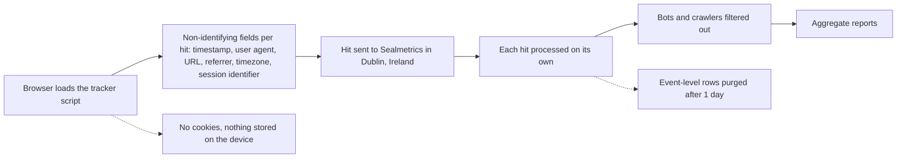

# How Sealmetrics Works

Sealmetrics measures your website traffic without cookies, consent banners or personal data, on a simple principle: **measure everything, identify no one**. You add one script tag; every visit is recorded as a set of non-identifying signals; your reports show aggregate patterns.

## What gets recorded

A small set of non-identifying fields per hit:

1. **Timestamp** — when the visit happened
2. **User Agent** — used for anonymous device classification (browser, OS, device type). The raw string is never written to storage; only the derived categories persist in aggregates
3. **Current URL** — which page was viewed
4. **Referral URL** — where the visitor came from
5. **Browser timezone** — used to assign the visit's country
6. **Session identifier** — tells a second pageview from a new entrance (see below)

No IP addresses stored, no cookies, no localStorage, no persistent identifiers. Hits within one visit are grouped by a session identifier: the tracker computes, in the browser, a hash of standard device characteristics (a device fingerprint) that is never written to the device. On the server it is re-keyed with a salt that rotates and is destroyed every day, so the stored identifier changes daily and cannot recognise a returning visitor on another day. A session ends after roughly two hours of inactivity.

Because no personal data is stored and nothing is stored on the visitor's device, there is no consent to ask for — which is also why cookie-based tools lose 15–60% of visitor data in EU markets — depending on sector, brand strength and traffic mix — while Sealmetrics does not. The tracker does read standard browser properties to compute the session identifier; [Analytics Cookies: Consent Exemption Requirements](/compliance/analytics-cookies-exemption) covers how the audience-measurement exemption criteria apply to that read. The full reasoning is in [What is Consentless Analytics?](/security-privacy/consentless-analytics), and the exact field list with retention is in [What We Track](/security-privacy/what-we-track).

## What you get in reports

Traffic and entrances, traffic sources and campaigns, conversions and revenue with last-click attribution at channel level, aggregate engagement (bounce rate, engagement rate, pages per session), country from browser timezone, and device/browser breakdowns. Hits appear within seconds — the **Last hit** timestamp on the Overview report lets you verify your install immediately.

What you do not get is anything that needs a persistent identifier: unique visitors, session duration, cross-session journeys or cohorts. See the [Metrics Reference](/reports/definitions) for how each metric is calculated.

## How the data flows

1. The tracker (1.1 KB gzipped, asynchronous) detects page views and the events you instrument.
2. Hits are sent to Sealmetrics infrastructure in **Dublin, Ireland**. IPs are used in memory only for anti-abuse checks and are never persisted in the analytics database.
3. Each hit is processed on its own and aggregated. Event-level rows are purged after 1 day; daily aggregates and conversions are kept 24 months.
4. Known bots, crawlers, scrapers and monitoring tools are filtered out so reports show real visitors — see [Bot Detection](/security-privacy/bot-detection).

The same path, from the browser to your reports:

## Getting started

Add one script tag to your `<head>`, then instrument conversions with `sealmetrics.conv()`. It works with any stack — WordPress, React, Vue, plain HTML — natively or through Google Tag Manager. A REST API and CSV export are available for pulling the data into your own systems.

## Related documentation

- [First Steps with Sealmetrics](/getting-started/quick-start) — go from signup to live data
- [Installation](/implementation/tracker/installation) — add the script tag
- [What is Consentless Analytics?](/security-privacy/consentless-analytics) — the model and its legal basis
- [What We Track vs What We Don't](/security-privacy/what-we-track) — every field, with retention
- [Overview Report](/reports/overview) — the aggregate insights this architecture produces
