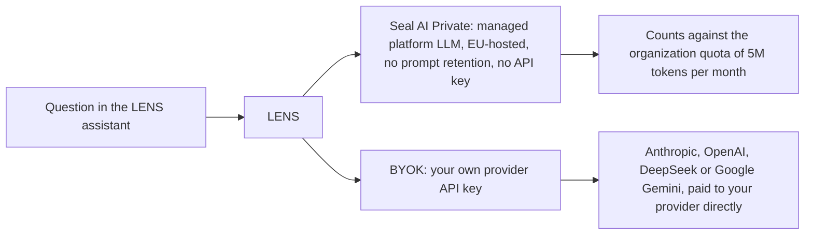

# Getting Started with LENS

Get LENS configured and receiving insights in under 5 minutes.

## Prerequisites

- A Sealmetrics account with an active plan
- At least 7 days of tracking data (so LENS has enough history to compare against)
- Email notifications enabled in your account settings

## Step 1: Access LENS

1. Log in to your Sealmetrics dashboard
2. Click **LENS** in the main navigation
3. You'll land on the LENS overview, where you can open **Chat** or **Reports**

## Step 2: Pick a provider

The LENS assistant supports two options:

- **[Seal AI Private](/billing/seal-ai-private)** — the managed platform LLM (EU-hosted, no prompt retention). **No API key needed**; usage counts against your organization's quota of **5M tokens per month**, plus any non-expiring token packs. Owners/admins can check consumption anytime in **Organization → Seal AI Usage**.
- **Bring-your-own-key (BYOK)** — connect your own provider API key. No quota imposed by Sealmetrics; you pay your provider directly.

If your organization is entitled to Seal AI Private (included in Scale/Enterprise, add-on on Growth), it's active by default. To use a BYOK provider, go to **My Account → LLM Providers** and add an API key.

Where a question goes depends only on which option is active:



**Supported providers** (LENS picks the model automatically based on task complexity):

| Provider | Simple tasks | Complex / critical tasks |
|----------|--------------|--------------------------|
| **Seal AI Private** (platform) | Managed for you | Managed for you |
| Anthropic (BYOK) | `claude-3-5-haiku` | `claude-sonnet-4` / `claude-opus-4` |
| OpenAI (BYOK) | `gpt-4o-mini` | `gpt-4o` |
| DeepSeek (BYOK) | `deepseek-chat` | `deepseek-chat` |
| Google Gemini (BYOK) | `gemini-2.5-flash` | `gemini-2.5-pro` |

Mark one provider as your default and save.

:::info Seal AI Private quota
Seal AI Private includes **5M tokens per calendar month** for the whole organization, plus any [token packs](/billing/seal-ai-private#extra-token-packs) you've purchased (packs never expire). The org gets an email at 80% and 100% consumption; once quota and packs are exhausted, Seal AI stops with a "token limit reached" message until the monthly reset — the owner can buy a pack from the [Seal AI Usage screen](/platform/settings/seal-ai-usage), and any user can switch the chat to a BYOK provider for immediate headroom.
:::

## Step 3: Ask Your First Question

Try the AI assistant:

1. Go to **LENS → Chat**
2. Type a question like:
   - *"What were my top traffic sources last week?"*
   - *"How is my conversion rate trending?"*
   - *"Are there any issues I should know about?"*
3. LENS will analyze your data and respond

### Tips for Better Answers

| Do | Don't |
|----|-------|
| Be specific about time periods | Ask vague questions |
| Mention specific metrics | Assume LENS knows context |
| Ask follow-up questions | Ask multiple questions at once |

**Good:** *"Why did organic traffic from Google drop last Tuesday?"*

**Less helpful:** *"Why is traffic down?"*

## Step 4: Review Your LENS Reports

LENS produces **weekly** and **monthly** reports — an executive summary plus key metrics, channel performance, top insights and action items. Reports are generated for a completed period (there are no custom templates or per-report recipient lists).

1. Go to **LENS → Reports**
2. Open the latest weekly or monthly report
3. To receive a recurring summary by email, enable email notifications and set the analysis frequency in **Settings → LENS** (`daily`, `weekly`, or `manual`)

See [LENS Reports](/lens/reports) for what each report contains.

## Automated insight detection (roadmap)

:::caution Not live yet
The rule-based detection library is **built but not active**. No detection rule currently runs on customer accounts, and no automated insight or anomaly alert is generated today. This section documents the planned behaviour — see the [LENS overview](/lens) for what is live. What works today is LENS chat (Step 3) and LENS reports (Step 4).
:::

The planned library produces five types of insight, so it won't be only about anomalies:

| Type | What it means |
|------|---------------|
| Anomaly | An unexpected change in a metric |
| Opportunity | A potential improvement worth acting on |
| Trend | A significant directional change over time |
| Alert | A warning that needs attention |
| Health | A tracking or data-quality issue |

The planned launch set ("LENS Basic") covers traffic drops and spikes, conversion drops, tracking health, device and landing-page performance, channel efficiency, and source-concentration risk — none of which will require e-commerce or microconversion setup.

Once detection ships, an insight will look something like this (here, an anomaly):

```
🔴 HIGH PRIORITY
Conversion Rate Drop Detected

Your conversion rate dropped 35% compared to the
previous 7-day average.

Current: 1.2%
Previous: 1.85%
Change: -35.1%

Detected: 2026-08-10 14:32 UTC
Affected segment: All traffic

[View Details] [Investigate] [Dismiss]
```

### Insight Severity Levels

| Level | Icon | Meaning | Action |
|-------|------|---------|--------|
| Critical | 🔴 | Immediate attention needed | Investigate now |
| Warning | 🟡 | Significant change detected | Review within 24h |
| Info | 🔵 | Notable but expected | Acknowledge when convenient |

## Next Steps

<div style={{
  display: 'grid',
  gridTemplateColumns: 'repeat(auto-fit, minmax(200px, 1fr))',
  gap: '1rem',
  marginTop: '1rem'
}}>
  <a href="./anomaly-detection/rule-types" style={{
    display: 'block',
    border: '1px solid #e0e0e0',
    borderRadius: '8px',
    padding: '1rem',
    textDecoration: 'none',
    color: 'inherit'
  }}>
    <strong style={{ color: '#00825C' }}>Explore All Rules</strong>
    <p style={{ margin: '0.5rem 0 0', fontSize: '0.85rem' }}>
      See the planned LENS Basic rule library across all 11 categories.
    </p>
  </a>
  <a href="./ai-assistant/best-practices" style={{
    display: 'block',
    border: '1px solid #e0e0e0',
    borderRadius: '8px',
    padding: '1rem',
    textDecoration: 'none',
    color: 'inherit'
  }}>
    <strong style={{ color: '#00825C' }}>AI Best Practices</strong>
    <p style={{ margin: '0.5rem 0 0', fontSize: '0.85rem' }}>
      Get better answers from the AI assistant.
    </p>
  </a>
</div>

## Troubleshooting

### "No insights or anomalies shown"

Expected: automated detection is not active yet (see the roadmap note above), so
no account currently generates insights. Use **Chat** to ask about your data, and
**Reports** for the weekly and monthly summaries.

### "Assistant not responding"

The answer depends on which provider you're on — check **My Account → LLM Providers** to see which one is active.

**On Seal AI Private** (no API key involved):
1. Your organization may have exhausted its 5M monthly tokens plus any packs — the chat says "token limit reached". Check **Organization → Seal AI Usage**; an owner can buy a [token pack](/billing/seal-ai-private#extra-token-packs), or any user can switch to a BYOK provider for immediate headroom.
2. Confirm your plan still includes Seal AI (add-on on Growth, included in Scale and Enterprise).

**On bring-your-own-key:**
1. You've added an API key in **My Account → LLM Providers**
2. A default provider is selected and enabled
3. The key is still valid and hasn't expired or hit your provider's own rate limit

### Email summaries not arriving

Check:
1. Email notifications are enabled in account settings
2. Messages aren't going to spam
