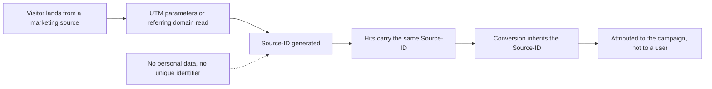

# How Attribution Works Without a User-ID

Canonical page: https://docs.sealmetrics.com/security-privacy/attribution-without-userid

Sealmetrics delivers accurate campaign and conversion attribution without using User-IDs, cookies, fingerprinting, or session reconstruction. This article explains the mechanism behind our privacy-preserving attribution system.

---

## Why Traditional Analytics Require User-IDs

Conventional analytics platforms depend on identifiers to track user journeys:

- Cookie IDs
- Device IDs
- Fingerprints
- Cross-session identifiers

These technologies **link visits, clicks, and conversions to individuals**, which legally requires consent under GDPR and ePrivacy.

Sealmetrics does **not** use any of these identifiers.

---

## Sealmetrics' Privacy-First Approach

Sealmetrics does **not**:

❌ Track individual users across sessions
❌ Link a hit to a person (there is no personal identifier to link with)
❌ Store IP addresses
❌ Use cookies or persistent identifiers

The user agent is used for anonymous device classification (browser/OS category): the raw string is purged with the event row after 1 day, and only the derived categories persist in the 24-month aggregates. Neither can be joined with anything that identifies the person — because no such identifier exists. Short-lived session context exists inside a single browsing session (~2-hour inactivity), never across sessions or devices.

---

## The Key Innovation — The Source-ID

Instead of identifying users, Sealmetrics groups traffic and conversions using a **Source-ID**, derived exclusively from **traffic source characteristics**, not from user behavior.

### A Source-ID is generated from:

- `utm_source`
- `utm_medium`
- `utm_campaign`
- `utm_term`
- OR the referring domain

No personal data. No unique identifiers.

### How It Works

1. A visitor lands on the site from a marketing source
2. Sealmetrics reads the traffic parameters
3. A **Source-ID** is generated from those parameters
4. All hits with the same campaign parameters share the same Source-ID
5. Conversions inherit the same Source-ID

This groups interactions by **campaign**, not by user.

The whole chain, with no identifier anywhere in it:

---

## Example — Attribution in Action

### 🔵 Step 1: User clicks a Google Ads campaign
UTM parameters detected → Source-ID created.

### 🟣 Step 2: They browse the site
Hits remain isolated but carry the same Source-ID.

### 🟢 Step 3: They convert
The conversion is assigned to the same Source-ID.

### Result
**Conversion is attributed to Google Ads → Campaign XYZ → Keyword ABC.**

No user identification required.

---

## Why This Needs No Consent

Because no identifier is created and nothing is stored on the device, the obligations these frameworks attach to personal data and to terminal storage are not triggered:

- ✔ No personal data
- ✔ No user identification
- ✔ No behavioral profiling
- ✔ No cross-session linkage
- ✔ No consent required

Privacy protection is embedded by design.

---

## What You Can Measure With Source-ID

Even without User-IDs, Sealmetrics provides full marketing intelligence:

### Campaign Analytics
- Traffic by campaign
- Source/medium performance
- UTM analytics
- Cost attribution
- ROAS

### Conversion Analytics
- Conversions per channel
- Revenue attribution
- Aggregated funnel insights
- Lead and e-commerce conversions

### Accuracy Benefits
- No consent loss
- No cookie rejection
- 100% traffic + 100% conversions measured

---

## Summary

Sealmetrics proves that accurate attribution **does not** require user tracking.

We achieve attribution by grouping hits by **campaign characteristics**, not by individuals.

- 🟢 No personal data processed
- 🟢 Every hit measured — no loss from consent rejection
- 🟢 No User-IDs, no cookies, no consent banner

Because no personal data is involved, no consent is required — see [Why Sealmetrics Can Measure Without Consent](/security-privacy/why-no-consent). Sealmetrics holds no third-party security certification, and the [compliance pages](/compliance) are self-assessments.

## Related documentation

- [How Attribution Accuracy Works](/reports/insights/attribution-accuracy) — how last-click, source-based attribution performs
- [What We Track vs What We Don't](/security-privacy/what-we-track) — the non-identifying signals that feed the Source-ID
- [How Consentless Tracking Works](/security-privacy/how-consentless-works) — the isolated-hit model behind this approach
- [Sources Report](/reports/sources) — see traffic and conversions grouped by source and campaign
- [Attribution Model](/faq/attribution) — how Sealmetrics assigns conversions to channels
