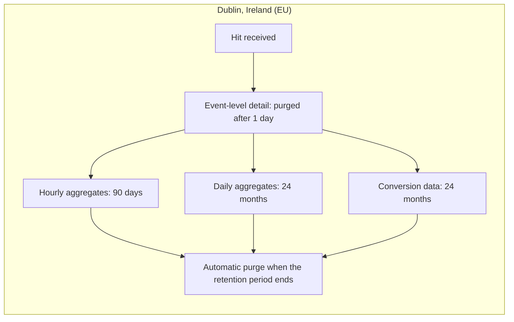

# Data Location & Retention

Canonical page: https://docs.sealmetrics.com/security-privacy/data-location

Sealmetrics is committed to data sovereignty and transparent retention policies.

---

## Data Location

### Customer Analytics Data: Dublin, Ireland

All customer analytics data — every hit, report, and backup — is stored and processed in **Dublin, Ireland (EU)**:

| Component | Location | Provider |
|-----------|----------|----------|
| Application servers | Dublin, Ireland | EU data center |
| Analytics database | Dublin, Ireland | EU data center |
| Backups | Dublin, Ireland | EU data center |

### Why EU?

- **GDPR compliance** — Data stays within EU jurisdiction
- **Data sovereignty** — No US CLOUD Act concerns for stored data
- **Low latency** — Fast response times for European users
- **Legal clarity** — Single regulatory framework

### No Transfer of Analytics Data Outside the EU

Analytics data is hosted and processed only in the EU (Dublin). Your analytics data:

- Is stored and processed exclusively on EU infrastructure
- Is not transferred to any third country
- Remains under EU data protection law

---

## Data Retention Periods

### Analytics Data

Retention is **fixed and identical for every plan**, enforced by database TTLs:

| Data Type | Retention | Notes |
|-----------|-----------|-------|
| Event-level detail | 1 day | Individual hit data, then purged |
| Hourly aggregates | 90 days | Hour-by-hour reports |
| Daily aggregates | 24 months | Daily/monthly reports |
| Conversion data | 24 months | Including properties |

From a single hit to the reports you keep, every stage lives in Dublin and expires on its own TTL:

### Operational Data

| Data Type | Retention | Notes |
|-----------|-----------|-------|
| Raw logs | 1 day | For debugging only |
| Error logs | 30 days | System diagnostics |
| API access logs | 90 days | Security audit trail |

### Real-time / Session Data

| Data Type | Retention | Notes |
|-----------|-----------|-------|
| Session state (Redis) | 2 hours | Ephemeral, in-memory session grouping |

---

## Why 24 Months?

The 24-month retention for aggregated reports and conversions allows:

1. **Year-over-year comparison** — Compare current month to same month last year
2. **Seasonal analysis** — Full 2-year cycle for seasonal businesses
3. **Trend identification** — Long-term patterns become visible
4. **Regulatory compliance** — Meets typical audit requirements

---

## Data Deletion

### Automatic Deletion

Data older than retention period is automatically purged:

- Runs daily during low-traffic hours
- Irreversible deletion
- No recovery possible

### Manual Deletion

You can request early deletion:

1. **Single account** — Contact support
2. **Specific date range** — Provide details
3. **Full account deletion** — Account closure

### Account Closure

When you close your account:

- All data deleted within 30 days
- Backups purged within 90 days
- No data retained after that

---

## What We Store

### Collected Data Points

| Data | Stored | Purpose |
|------|--------|---------|
| Page URL | Yes | Page analytics |
| Referrer | Yes | Traffic sources |
| UTM parameters | Yes | Campaign tracking |
| Device info | Yes | Device reports |
| Browser | Yes | Browser analytics |
| Country | Yes | Geographic reports |
| Timestamp | Yes | Timing analysis |
| Session ID | Yes (hashed) | Session grouping |

### Not Stored

| Data | Stored | Why |
|------|--------|-----|
| IP address | No | Privacy |
| Cookies | No | Consentless |
| Email | No | Not collected |
| Name | No | Not collected |
| User ID | No | Privacy |

---

## Data Security

### Encryption

| State | Encryption |
|-------|------------|
| In transit | TLS 1.3 |
| At rest | AES-256 |
| Backups | AES-256 |

### Access Control

- Role-based access
- Audit logging
- Two-factor authentication available
- IP allowlist option

---

## Regulatory Compliance

| Framework | Status |
|-----------|--------|
| GDPR | Compliant |
| ePrivacy | Compliant |

Sealmetrics does not hold third-party security certifications (such as SOC 2 or ISO 27001). Compliance with GDPR and ePrivacy is based on the architecture described above — nothing stored on the device, no data that identifies anyone, a session identifier that rotates daily and cannot be reconstructed, EU-only processing — and is documented in the [compliance self-assessments](/compliance).

---

## Subprocessors

Sealmetrics keeps its subprocessor list deliberately short. The authoritative, always-current list is **Annex 3 of the [Data Processing Agreement](https://sealmetrics.com/dpa)**.

As of this review it names Noraina Limited (Ireland — infrastructure and database hosting), Scaleway SAS (Paris — managed LLM inference for Seal AI Private) and Resend (US, under SCCs — service emails). All subprocessors sign data processing agreements that bind them to GDPR obligations. **Visitor analytics data is processed and stored exclusively in the EU.**

Full details: [Subprocessors](/compliance/subprocessors)

---

## Data Portability

Export your data anytime:

1. **Dashboard exports** — CSV downloads
2. **API access** — Full programmatic access
3. **Bulk export** — Contact support for large exports

---

## Questions?

- **DPO contact** — privacy@sealmetrics.com
- **Data requests** — support@sealmetrics.com
- **Legal inquiries** — legal@sealmetrics.com

---

## Related Documentation

- [Security & Privacy overview](/security-privacy)
- [What We Track](/security-privacy/what-we-track)
- [Subprocessors](/compliance/subprocessors)
- [Data Subject Rights (DSAR)](/compliance/data-subject-rights)
- [GDPR Compliance](/compliance/compliance-overview/legal-faq)
- [Why Sealmetrics Can Measure Without Consent](/security-privacy/why-no-consent)
- [Frequently Asked Questions](/faq/privacy-security)
